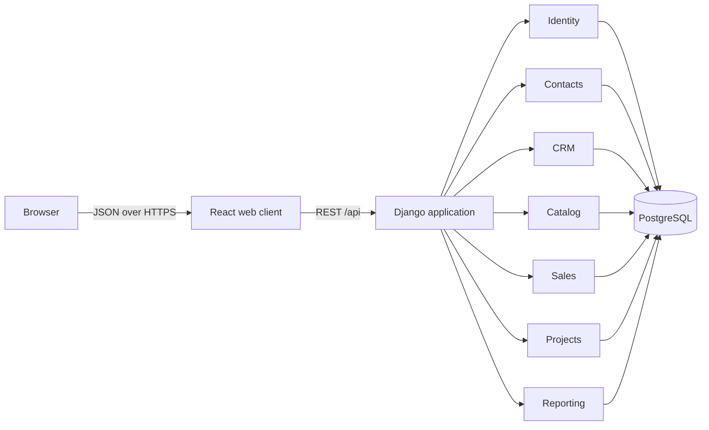

# Architecture

## Context

Mirai Mini ERP is a learning system for six contributors working for six weeks. It borrows Odoo's
strongest architectural idea—business capabilities packaged as modules—without recreating Odoo's
ORM, metadata-driven UI, or full ERP breadth.

## System shape

The deployable unit is a modular monolith: one frontend, one backend process, and one PostgreSQL
database. Module boundaries remain explicit in code so the team can work in parallel without the
operational cost of distributed services.

## Module responsibilities

| Module | Owns | May depend on |
|---|---|---|
| `core` | Health, shared primitives, API infrastructure | Nothing in the business layer |
| `identity` | Users, roles, authentication, authorization helpers | `core` |
| `contacts` | Customers and people | `core`, `identity` |
| `crm` | Leads, opportunities, stages, sales activities | `contacts`, `identity` |
| `catalog` | Products and prices | `core` |
| `sales` | Quotations and quotation lines | `contacts`, `crm`, `catalog`, `identity` |
| `projects` | Projects, tasks, comments | `contacts`, `sales`, `identity` |
| `reporting` | Read models and dashboard queries | All modules, read-only |

Dependencies flow in one direction. A lower module must not import a higher module. Cross-module
side effects are coordinated by an application service in the initiating module. For the MVP,
confirming a quotation calls a projects service inside one database transaction.

## Backend layering

Each business module will use four layers as it grows:

1. `models.py`: persistence and domain invariants.
2. `services.py`: use cases and cross-record transactions.
3. `serializers.py`: API input/output contracts.
4. `views.py` and `urls.py`: HTTP transport and permissions.

Views must not contain pricing rules or workflow transitions. Reporting may query other modules but
must not mutate their records.

## Frontend structure

- `components`: reusable, domain-neutral UI.
- `features/<module>`: pages, queries, forms, and tests for one business capability.
- `lib`: API client and cross-cutting browser utilities.
- `styles`: design tokens and global layout primitives.

The frontend consumes explicit REST resources. Server models are not exposed automatically.

## Security boundary

- Authentication uses secure, HTTP-only session cookies for the browser client.
- CSRF protection remains enabled for state-changing requests.
- Permissions are checked server-side; hidden buttons are usability, not security.
- Admin can manage everything, Manager can manage team-owned business records, and Member can work
  with assigned records. Exact record rules are delivered in week 2.
- Secrets are environment variables and never committed.

## Operational baseline

- Local and CI environments use the same dependency manifests.
- SQLite is allowed only for quick local tests; Docker and CI exercise PostgreSQL.
- `/api/health/` checks both application and database readiness.
- Containers log to standard output. Structured production logging is a week 5 concern.

## Architecture decisions

- [ADR-0001: Modular monolith](adr/0001-modular-monolith.md)
- [ADR-0002: Technology stack](adr/0002-technology-stack.md)
- [ADR-0003: Browser authentication](adr/0003-browser-authentication.md)
