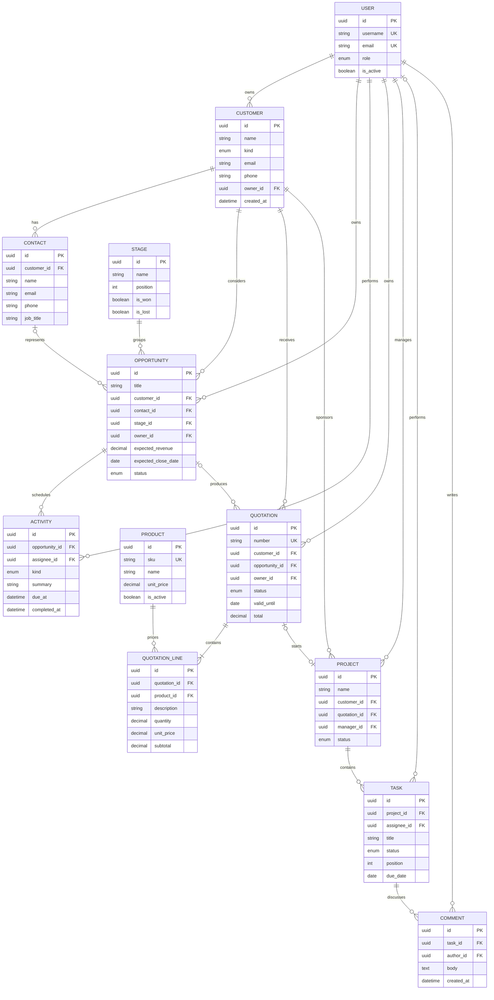

# Target entity relationship diagram

This is the agreed MVP data model. Week 1 implements only the custom `User` foundation; feature
owners introduce the remaining tables with reviewed migrations during weeks 2–4.

## Shared modeling rules

- Business entities use UUID primary keys; human-facing documents also receive sequential numbers.
- Money uses fixed-precision decimal fields and never floating point.
- Timestamps are stored in UTC and rendered in the user's locale.
- Deletion defaults to protection or soft deactivation for referenced master data.
- Derived totals are recalculated by backend services inside the write transaction.
