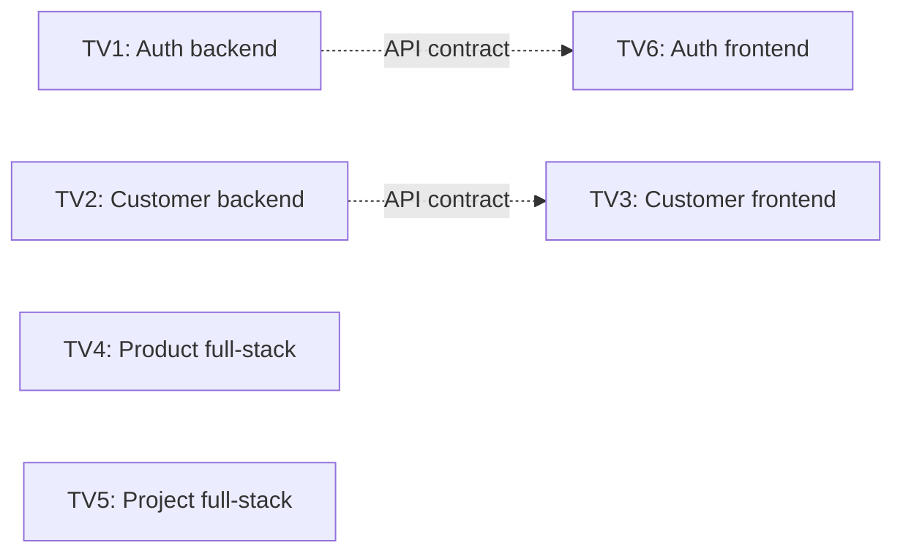

# Kế hoạch công việc Tuần 2 — Core Platform và Master Data

## 1. Mục tiêu của tuần

Tuần 2 có 6 thành viên, mỗi người làm khoảng 12–15 giờ.

Mục tiêu chính là biến bộ khung của Tuần 1 thành một ứng dụng có thể sử dụng được. Cuối tuần, nhóm
cần demo được luồng sau:

1. Admin đăng nhập và quản lý tài khoản.
2. Member đăng nhập và xem đúng thông tin của mình.
3. Member tạo khách hàng và thêm người liên hệ.
4. Member tìm khách hàng bằng tên, email, số điện thoại hoặc tên người liên hệ.
5. Member tạo cơ hội bán hàng cho khách hàng.
6. Manager tạo sản phẩm.
7. Manager tạo dự án và giao việc cho Member.
8. Người không có quyền bị API từ chối.
9. Các bài kiểm tra và CI đều chạy thành công.

Ba phần bắt buộc phải hoàn thành là:

- Đăng nhập và phân quyền.
- Customer/Contact từ backend đến frontend.
- API client, giao diện dùng chung và kiểm thử luồng chính.

Các tài liệu nên đọc trước khi bắt đầu:

- [Kiến trúc](architecture.md)
- [ERD mục tiêu](erd.md)
- [Quy ước API](api-conventions.md)
- [Quy trình phát triển](development.md)
- [Kế hoạch kiểm thử](test-plan.md)
- [Design system](design-system.md)

## 2. Một số khái niệm dành cho người mới

- **Backend**: phần xử lý dữ liệu, quyền truy cập và API trên máy chủ.
- **Frontend**: phần giao diện mà người dùng nhìn thấy và thao tác.
- **API contract**: thỏa thuận giữa backend và frontend về đường dẫn API, dữ liệu gửi lên và dữ liệu
  trả về.
- **Mock API**: API giả lập dùng để làm giao diện khi backend thật chưa hoàn thành.
- **Migration**: file mô tả thay đổi cấu trúc cơ sở dữ liệu.
- **Seed data**: dữ liệu mẫu dùng để phát triển và demo.
- **E2E test**: bài kiểm tra mô phỏng một người dùng thực hiện trọn vẹn một luồng trên ứng dụng.
- **Owner**: người chịu trách nhiệm chính cho một phần việc.
- **Reviewer**: người kiểm tra code trước khi merge.

## 3. Cách làm để không phải chờ nhau

Ngày đầu tiên, các owner backend phải chốt API contract và đưa ví dụ request/response cho frontend.
Frontend bắt đầu ngay bằng mock API, không cần đợi backend thật hoàn thành.



Quy tắc làm việc:

1. Chốt tên field, endpoint và quyền truy cập trước khi viết phần xử lý chi tiết.
2. Frontend dùng dữ liệu giả lập có cùng cấu trúc với API contract.
3. Backend viết test API mà không phụ thuộc frontend.
4. TV5 dùng Customer UUID mẫu trong lúc chờ Customer API thật. TV4 có thể làm Product độc lập.
5. Mỗi PR chỉ giải quyết một nhóm việc nhỏ; không giữ một PR lớn suốt cả tuần.
6. Khi API thật sẵn sàng, frontend chỉ thay mock bằng API thật và chạy lại test.

## 4. Bảng phân công mới

| Thành viên | Công việc chính | Người review | Mức ưu tiên |
|---|---|---|---|
| TV1 | Backend đăng nhập, tài khoản và phân quyền | TV4 | P0 |
| TV2 | Backend Customer và Contact | TV5 | P0 |
| TV3 | Frontend Customer/Contact và CRM foundation | TV6 | P0 trước, P1 sau |
| TV4 | Product Catalog full-stack | TV1 | P1 |
| TV5 | Project và Task full-stack | TV2 | P1 |
| TV6 | Auth frontend, API client, component dùng chung và QA | TV3 | P0 |

Mỗi người chịu trách nhiệm về tiến độ, test, tài liệu và phần demo thuộc phạm vi của mình. Khi hoàn
thành sớm, ưu tiên hỗ trợ phần P0 trước.

## 5. TV1 — Backend đăng nhập và phân quyền

### Kết quả cần đạt

Backend có thể xác thực người dùng bằng email, tạo session và kiểm tra đúng quyền của Admin, Manager
và Member.

### Công việc

- Hoàn thiện model `User` với ba role: `admin`, `manager`, `member`.
- Làm API đăng nhập, đăng xuất và lấy thông tin người đang đăng nhập.
- Làm API để Admin xem, tạo và sửa tài khoản.
- Tạo các permission dùng chung:
  - `IsAdmin`
  - `IsManagerOrAdmin`
  - helper kiểm tra owner hoặc assignee.
- Đăng ký User trong Django admin.
- Tạo lệnh seed dữ liệu demo; chạy nhiều lần không được tạo bản ghi trùng.
- Không ghi password, session key hoặc CSRF token vào log.
- Gửi API contract và response mẫu cho TV6 ngay trong ngày đầu.

### API cần có

| Method | Endpoint | Ai được dùng? |
|---|---|---|
| POST | `/api/auth/login/` | Mọi người |
| POST | `/api/auth/logout/` | Người đã đăng nhập |
| GET | `/api/auth/me/` | Người đã đăng nhập |
| GET | `/api/users/` | Admin |
| POST | `/api/users/` | Admin |
| PATCH | `/api/users/{id}/` | Admin |

Ví dụ đăng nhập:

```json
{
  "email": "admin@example.test",
  "password": "local-demo-password"
}
```

Ví dụ dữ liệu trả về:

```json
{
  "id": "6b7b75e4-5798-48b7-bddb-cf097ee93e65",
  "email": "admin@example.test",
  "username": "admin",
  "first_name": "System",
  "last_name": "Admin",
  "role": "admin"
}
```

### Test tối thiểu

- Đăng nhập đúng tạo được session.
- Đăng nhập sai trả lỗi rõ ràng.
- Tài khoản bị khóa không đăng nhập được.
- Người chưa đăng nhập không gọi được API nội bộ.
- Member không gọi được API quản lý user.
- Response tạo user không trả lại password.
- Sau khi logout, session cũ không còn dùng được.

## 6. TV2 — Backend Customer và Contact

### Kết quả cần đạt

Backend lưu được khách hàng và người liên hệ, tìm kiếm được dữ liệu và chỉ trả dữ liệu mà người dùng
có quyền xem.

### Công việc

- Tạo model, migration và API cho `Customer` và `Contact`.
- Member tạo Customer thì backend tự gán owner là người đang đăng nhập.
- Admin xem được tất cả Customer.
- Manager xem Customer của mình và của Member trong phạm vi team tạm thời.
- Member chỉ xem được Customer do mình sở hữu.
- Hỗ trợ tìm kiếm theo tên Customer, tên Contact, email và số điện thoại.
- Dùng deactivate thay cho xóa Customer khỏi cơ sở dữ liệu.
- Mỗi Customer chỉ có tối đa một Contact chính.
- Chốt API contract và dữ liệu mẫu với TV3 trong ngày đầu.

### Dữ liệu chính

`Customer` gồm:

- `id`, `name`, `kind`, `email`, `phone`.
- `owner`, `is_active`.
- `created_at`, `updated_at`.

`Contact` gồm:

- `id`, `customer`, `name`, `job_title`.
- `email`, `phone`, `is_primary`.
- `created_at`, `updated_at`.

### API cần có

| Method | Endpoint | Mục đích |
|---|---|---|
| GET | `/api/customers/` | Xem và tìm Customer |
| POST | `/api/customers/` | Tạo Customer |
| GET | `/api/customers/{id}/` | Xem chi tiết |
| PATCH | `/api/customers/{id}/` | Sửa Customer |
| POST | `/api/customers/{id}/deactivate/` | Ngừng hoạt động |
| GET | `/api/customers/{id}/contacts/` | Xem Contact |
| POST | `/api/customers/{id}/contacts/` | Thêm Contact |
| PATCH | `/api/contacts/{id}/` | Sửa Contact |
| DELETE | `/api/contacts/{id}/` | Xóa Contact khi được phép |

Ví dụ tìm kiếm:

```text
GET /api/customers/?search=acme&kind=company&is_active=true&page=1
```

### Test tối thiểu

- Tên bắt buộc và email đúng định dạng.
- Mỗi Customer chỉ có một Contact chính.
- Member chỉ thấy Customer của mình.
- Manager và Admin thấy đúng phạm vi dữ liệu.
- Tìm được Customer qua tên Contact, email hoặc số điện thoại.
- Deactivate không làm mất Customer và Contact.
- Member không thể tự gán Customer cho người khác bằng payload.
- API phân trang đúng contract.

## 7. TV3 — Frontend Customer/Contact và CRM foundation

TV3 làm theo thứ tự: hoàn thành giao diện Customer/Contact trước, sau đó mới chuyển sang CRM.

### Phần A — Frontend Customer/Contact (P0)

#### Kết quả cần đạt

Người dùng có thể tạo, xem, sửa, tìm kiếm Customer và quản lý Contact trên giao diện.

#### Công việc

- Bắt đầu bằng mock API theo contract của TV2.
- Làm trang `/contacts` hiển thị danh sách Customer.
- Làm tìm kiếm và bộ lọc active/kind.
- Làm trang tạo mới và chỉnh sửa bằng một form dùng chung.
- Làm trang chi tiết Customer và danh sách Contact.
- Làm form thêm/sửa Contact.
- Hiển thị rõ các trạng thái loading, không có dữ liệu, lỗi nhập liệu, 403 và lỗi chung.
- Khi API của TV2 sẵn sàng, thay mock bằng API thật và chạy lại test.

#### Test tối thiểu

- Danh sách hiển thị đúng dữ liệu.
- Form báo lỗi tại đúng field.
- Empty state và error state hiển thị đúng.
- Luồng tạo Customer và thêm Contact hoạt động với API thật.

### Phần B — CRM foundation (P1)

#### Kết quả cần đạt

Hệ thống có Stage và Opportunity cơ bản. Tuần này chỉ cần danh sách và form, chưa làm kanban.

#### Công việc

- Tạo các Stage: New, Qualified, Proposal, Won và Lost.
- Tạo model/API `Opportunity` gồm Customer, Contact, Stage, owner và doanh thu dự kiến.
- Contact được chọn phải thuộc đúng Customer.
- Doanh thu dự kiến không được âm.
- Member không được tự đổi owner sang người khác.
- Làm giao diện `/crm` dạng bảng và form đơn giản.
- Hỗ trợ lọc theo Stage, owner và Customer.
- Không làm thao tác won/lost hoàn chỉnh trong tuần này.

#### Test tối thiểu

- Seed Stage chạy nhiều lần không tạo trùng.
- Contact khác Customer bị từ chối.
- Doanh thu âm bị từ chối.
- Member không đổi được owner.
- Không thể chuyển sang Won/Lost bằng PATCH thông thường.
- Danh sách chỉ trả Opportunity đúng quyền.

Nếu tiến độ chậm, giữ lại model, API và test CRM; giao diện CRM có thể chuyển sang tuần sau.

## 8. TV4 — Product Catalog full-stack

### Kết quả cần đạt

Admin và Manager có thể quản lý sản phẩm. Member chỉ được xem sản phẩm.

### Công việc

- Tạo model, migration và API cho `Product`.
- SKU luôn được chuyển thành chữ hoa và không được trùng, kể cả khác chữ hoa/chữ thường.
- Đơn giá không được âm và được trả về API dưới dạng chuỗi decimal.
- Làm API xem, tạo, sửa, tìm kiếm và deactivate sản phẩm.
- Làm trang danh sách và form sản phẩm.
- Chỉ hiển thị nút tạo/sửa cho Admin và Manager.

`Product` gồm:

- `id`, `sku`, `name`, `description`.
- `unit_price`, `is_active`.
- `created_at`, `updated_at`.

### API cần có

| Method | Endpoint | Mục đích |
|---|---|---|
| GET | `/api/products/` | Xem và tìm sản phẩm |
| POST | `/api/products/` | Tạo sản phẩm |
| GET | `/api/products/{id}/` | Xem chi tiết |
| PATCH | `/api/products/{id}/` | Sửa sản phẩm |
| POST | `/api/products/{id}/deactivate/` | Ngừng hoạt động |

### Test tối thiểu

- `srv-001` được lưu thành `SRV-001`.
- Không thể tạo hai SKU chỉ khác chữ hoa/chữ thường.
- Không chấp nhận đơn giá âm.
- Member không thể tạo, sửa hoặc deactivate.
- Deactivate không xóa dữ liệu.
- Tìm kiếm theo SKU và tên hoạt động.
- Frontend định dạng giá đúng.

## 9. TV5 — Project và Task full-stack

### Kết quả cần đạt

Manager tạo được Project, tạo Task và giao Task cho Member. Member xem và cập nhật được Task đã giao
cho mình.

### Công việc

- Tạo model, migration và API cho `Project` và `Task`.
- Làm trang danh sách Project và trang chi tiết có Task list.
- Manager tạo Project, tạo Task và chọn người thực hiện.
- Member chỉ thấy Project có Task được giao cho mình.
- Member không được tự đổi Project, assignee hoặc manager.
- Khi Task chuyển sang `done`, backend tự đặt `completed_at`.
- Khi Task rời `done`, backend tự xóa `completed_at`.
- Dùng Customer UUID mẫu trong test cho đến khi model Customer của TV2 được merge.
- Tuần này dùng Select để đổi trạng thái; chưa làm kéo-thả.

`Project` gồm:

- `id`, `name`, `customer`, `manager`, `status`.
- `start_date`, `due_date`, `description`.
- `created_at`, `updated_at`.

`Task` gồm:

- `id`, `project`, `title`, `assignee`, `status`.
- `position`, `due_date`, `description`, `completed_at`.
- `created_at`, `updated_at`.

### API cần có

| Method | Endpoint | Mục đích |
|---|---|---|
| GET | `/api/projects/` | Xem Project có quyền truy cập |
| POST | `/api/projects/` | Tạo Project |
| GET | `/api/projects/{id}/` | Xem chi tiết |
| PATCH | `/api/projects/{id}/` | Sửa Project |
| GET | `/api/projects/{id}/tasks/` | Xem Task |
| POST | `/api/projects/{id}/tasks/` | Tạo Task |
| GET | `/api/tasks/{id}/` | Xem chi tiết Task |
| PATCH | `/api/tasks/{id}/` | Sửa hoặc cập nhật Task |

### Test tối thiểu

- Ngày kết thúc Project không trước ngày bắt đầu.
- Member chỉ thấy Project và Task đúng phạm vi.
- Member không thể giao Task cho người khác.
- Chuyển Task sang Done đặt `completed_at`.
- Mở lại Task xóa `completed_at`.
- Manager không sửa được Project của Manager khác.
- Customer không tồn tại hoặc không có quyền sẽ bị từ chối.

## 10. TV6 — Auth frontend, nền tảng giao diện và QA

### Kết quả cần đạt

Ứng dụng có trang đăng nhập, biết người dùng hiện tại là ai, dùng chung một API client và có các thành
phần giao diện cơ bản để mọi người không phải viết lại.

### Phần A — Auth frontend

- Bắt đầu bằng mock API theo contract của TV1.
- Làm trang `/login` gồm email, password, nút đăng nhập và thông báo lỗi.
- `AuthProvider` gọi `/api/auth/me/` khi ứng dụng khởi động.
- Không hiển thị nội dung nghiệp vụ khi chưa đăng nhập.
- Sidebar hiển thị tên, email và role thật.
- Nút logout đưa người dùng về trang đăng nhập.
- Làm màn hình quản lý user tối thiểu cho Admin.

### Phần B — API client và component dùng chung

API client cần:

- Lấy base URL từ `VITE_API_URL`.
- Luôn gửi session cookie.
- Hỗ trợ GET, POST, PATCH và DELETE.
- Gửi CSRF token cho request thay đổi dữ liệu.
- Chuẩn hóa lỗi để các form xử lý giống nhau.
- Đưa auth state về trạng thái chưa đăng nhập khi nhận HTTP 401.
- Hỗ trợ hủy request khi component không còn hiển thị.

Kiểu lỗi dùng chung:

```ts
type ApiError = {
  status: number;
  code: string;
  detail: string;
  fields?: Record<string, string[]>;
};
```

Component cần có:

- `Button`, `FormField`, `TextInput`, `SelectInput`.
- `DateInput`, `MoneyInput`, `Alert`, `StatusBadge`.
- `EmptyState`, `LoadingSkeleton`, `DataTable`.
- `Dialog`, `ConfirmDialog`, `PageHeader`, `FilterBar`.

Chỉ làm component khi có ít nhất một màn hình trong Tuần 2 cần sử dụng.

### Phần C — Kiểm thử

- Thiết lập mock API cho component test.
- Tạo dữ liệu mẫu cho Admin, Manager và Member.
- Cấu hình Playwright chạy trên Chromium.
- Viết E2E chính: đăng nhập → tạo Customer → thêm Contact → tìm theo Contact.
- Kiểm tra Member không mở được chức năng Admin.
- Kiểm tra luồng chính không có console error.
- Chạy smoke test ở kích thước desktop và mobile.
- Kiểm tra thao tác bàn phím trên trang login và Customer form.

## 11. Quyền truy cập cần thống nhất

| Hành động | Admin | Manager | Member đúng phạm vi | Member khác | Chưa đăng nhập |
|---|---:|---:|---:|---:|---:|
| Quản lý user | Có | Không | Không | Không | Không |
| Xem Customer | Tất cả | Phạm vi team tạm thời | Customer của mình | Không | Không |
| Tạo Customer | Có | Có | Có | Có | Không |
| Đổi owner Customer | Có | Trong phạm vi | Không | Không | Không |
| Xem Product | Có | Có | Có | Có | Không |
| Sửa Product | Có | Có | Không | Không | Không |
| Tạo Project | Có | Có | Không | Không | Không |
| Sửa Task | Có | Project mình quản lý | Task được giao | Không | Không |
| Tạo Opportunity | Có | Có | Khi có quyền với Customer | Không | Không |

“Phạm vi team tạm thời” nghĩa là Tuần 2 chưa có Team model. Quy tắc tạm này phải được ghi rõ trong
code và test, không được hiểu là hệ thống đã hỗ trợ nhiều team hoàn chỉnh.

## 12. Kế hoạch theo ngày

### Ngày 1 — Chốt cách giao tiếp giữa các phần

- TV1 và TV2 chốt API contract, response mẫu và quy tắc lỗi.
- TV6 và TV3 tạo mock API tương ứng.
- TV4 và TV5 chốt model/API trong module của mình.
- Cả nhóm thống nhất cách trả 403 hoặc 404 khi người dùng không có quyền xem một object.

### Ngày 2–3 — Làm song song

- TV1, TV2 làm backend và test.
- TV3, TV6 làm frontend bằng mock API.
- TV4, TV5 làm full-stack trong module độc lập.
- Mỗi người mở PR nhỏ ngay khi có phần đầu tiên chạy được.

### Ngày 4 — Tích hợp

- TV3 thay mock Customer bằng API thật của TV2.
- TV6 thay mock Auth bằng API thật của TV1.
- TV5 kết nối Project với Customer thật.
- Chạy test trên PostgreSQL và sửa lỗi tích hợp.

### Ngày 5 — Đóng tính năng và chuẩn bị demo

- Không thêm yêu cầu mới.
- Chỉ sửa lỗi, hoàn thiện test, tài liệu và seed data.
- Chạy E2E, kiểm tra desktop/mobile và diễn tập demo.

## 13. Cách chia Pull Request

| Thành viên | PR đầu tiên | PR tiếp theo |
|---|---|---|
| TV1 | User model, auth API, permissions và test | User seed/admin và sửa lỗi tích hợp |
| TV2 | Customer/Contact models và migration | API, permission, search và test |
| TV3 | Customer UI dùng mock API | Tích hợp API thật và CRM foundation |
| TV4 | Product backend và test | Product frontend |
| TV5 | Project/Task backend và test | Project/Task frontend |
| TV6 | API client, mock và shared components | Auth UI, E2E và accessibility |

Các file dễ xảy ra xung đột gồm `config/settings.py`, `config/urls.py` và navigation. Trước khi sửa
các file này, thành viên cần thông báo cho nhóm và thống nhất thứ tự merge.

## 14. Khi nào một công việc được coi là hoàn thành?

Một công việc chỉ được đánh dấu Done khi:

- Chạy được đúng kịch bản đã mô tả.
- Có migration nếu thay đổi model.
- API tuân theo tài liệu quy ước chung.
- Quyền được kiểm tra ở backend, không chỉ ẩn nút trên frontend.
- Có test cho cả trường hợp thành công và bị từ chối.
- UI có loading, empty, validation, forbidden và generic-error state khi phù hợp.
- Không dùng kiểu float để lưu hoặc truyền số tiền.
- Không tin các field nhạy cảm do client gửi lên như owner, role hoặc status đặc biệt.
- Reviewer ngoài module đã kiểm tra và approve.
- CI xanh, không còn debug log hoặc secret.
- Seed data và tài liệu đã được cập nhật.
- Có thể demo bằng PostgreSQL.

## 15. Lệnh kiểm tra trước khi merge

Mỗi owner chạy:

```powershell
./scripts/check.ps1
docker compose config --quiet
```

Nếu thay đổi database hoặc liên quan nhiều module, chạy thêm:

```powershell
docker compose up -d --build
docker compose exec backend python manage.py migrate --noinput
docker compose exec backend python manage.py check
```

Reviewer cần kiểm tra:

- Migration có an toàn và chạy ổn định không?
- API list có tạo quá nhiều query không?
- Người dùng có thể sửa owner, role hoặc status trái phép không?
- List và detail có cùng quy tắc phân quyền không?
- Error response có đúng contract không?
- Test có kiểm tra trường hợp bị từ chối không?

## 16. Dữ liệu demo bắt buộc

Lệnh seed phải tạo dữ liệu mẫu và có thể chạy lại mà không tạo bản ghi trùng:

- `admin@example.test`: Admin.
- `manager@example.test`: Manager.
- `minh@example.test`: Member, owner của Acme.
- `lan@example.test`: Member, người được giao Task.
- `outsider@example.test`: Member dùng để kiểm tra trường hợp không có quyền.
- Customer: Acme Ltd và Nova Studio.
- Contact: Linh Nguyen thuộc Acme; An Tran thuộc Nova.
- Stage: New, Qualified, Proposal, Won và Lost.
- Product: `SRV-001 Implementation`, `SUP-001 Support`.
- Một Project mẫu và một Task giao cho Lan.

Mật khẩu demo chỉ được ghi trong hướng dẫn chạy local hoặc output của lệnh seed. Không hard-code mật
khẩu vào frontend và không dùng mật khẩu demo ở production.

## 17. Kịch bản demo cuối tuần

### Phần trình bày của từng người

- TV1: giải thích auth API, session và phân quyền.
- TV2: giải thích Customer/Contact API, tìm kiếm và ownership.
- TV3: tạo Customer, thêm Contact, tìm kiếm và tạo Opportunity.
- TV4: tạo Product và chứng minh Member chỉ được xem.
- TV5: tạo Project, giao Task và cập nhật Task sang Done.
- TV6: đăng nhập, quản lý user, chạy E2E và kiểm tra màn hình mobile.

### Thứ tự demo

1. Khởi động bằng database seed sạch.
2. Đăng nhập Admin và kiểm tra các tài khoản.
3. Đăng nhập Minh, tạo Customer, Contact và Opportunity.
4. Đăng nhập Manager, tạo Product, Project và Task.
5. Đăng nhập Lan, xem Task được giao và chuyển sang Done.
6. Đăng nhập Outsider, chứng minh không xem được dữ liệu ngoài phạm vi.
7. Chạy test và trình bày kết quả CI.

## 18. Nội dung không làm trong Tuần 2

- CRM kanban và kéo-thả Stage.
- Quy trình won/lost hoàn chỉnh.
- Quotation và tính tổng tiền.
- Project kanban, comment, file đính kèm và notification.
- Dashboard nghiệp vụ thật.
- Import/export CSV.
- Email, OAuth, quên mật khẩu và đăng ký công khai.
- Hệ thống quản lý nhiều công ty hoặc nhiều team hoàn chỉnh.

Yêu cầu mới không phục vụ kịch bản demo phải được đưa vào backlog thay vì thêm vào PR Tuần 2.

## 19. Phương án giảm phạm vi nếu chậm

Giảm theo thứ tự sau:

1. Bỏ giao diện CRM, giữ model, API và test.
2. Bỏ giao diện Project nâng cao, giữ danh sách và form cơ bản.
3. Bỏ trang chi tiết Product, giữ bảng và form.
4. Bỏ các bộ lọc phụ, giữ tìm kiếm chính.
5. Bỏ E2E permission thứ hai, giữ E2E Customer/Contact.

Không được bỏ:

- Đăng nhập và phân quyền ở backend.
- Customer/Contact backend, frontend và test.
- PostgreSQL migration và validation.
- Loading, error và validation state cơ bản.
- CI và review ngoài module.

## 20. Checklist kết thúc sprint

- [ ] Auth backend và phân quyền hoạt động đúng.
- [ ] Auth frontend sử dụng session thật.
- [ ] Customer/Contact backend và frontend hoàn chỉnh.
- [ ] Tìm kiếm Customer theo Contact hoạt động.
- [ ] CRM có model, API, test và giao diện cơ bản hoặc đã ghi rõ phần giảm scope.
- [ ] Product Catalog đạt yêu cầu.
- [ ] Project/Task đạt yêu cầu cơ bản.
- [ ] Shared components được ít nhất hai module sử dụng.
- [ ] E2E Customer/Contact chạy thành công.
- [ ] Test có cả trường hợp được phép và bị từ chối.
- [ ] Lệnh seed chạy nhiều lần không tạo dữ liệu trùng.
- [ ] Migration chạy được trên PostgreSQL sạch.
- [ ] Desktop và mobile smoke test thành công.
- [ ] Không có console error trong luồng chính.
- [ ] `scripts/check.ps1` và CI đều xanh.
- [ ] Tài liệu và ERD khớp với code cuối tuần.
- [ ] Cả nhóm đã diễn tập và hoàn thành demo.
